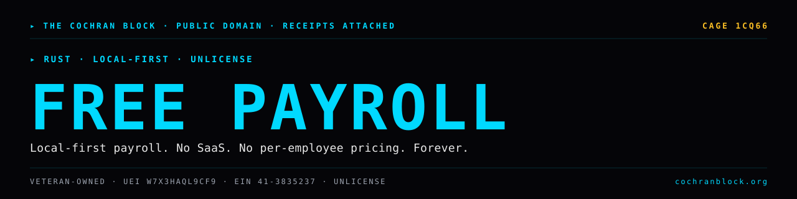

<!-- COCHRANBLOCK-BRAND-HEADER:START - generated by cochranblock/scripts/brand-stamp.sh -->
<picture>
  <source media="(prefers-color-scheme: dark)" srcset="assets/brand/banner.svg">
  <source media="(prefers-color-scheme: light)" srcset="assets/brand/banner.svg">
  
</picture>

[](https://unlicense.org)
[](https://www.rust-lang.org)
[](https://cochranblock.org)
[](https://cochranblock.org)

> &#9656; **RUST** &#183; **LOCAL-FIRST** &#183; **UNLICENSE**
<!-- COCHRANBLOCK-BRAND-HEADER:END -->


# free-payroll-system v0.1.0

**Free, open-source, local-first payroll. No SaaS. No per-employee pricing. No cloud.**

Single-binary Rust CLI that computes a balanced paystub (federal income tax + FICA + state) from a TOML employee config. Zero network I/O. Zero database. Every tax constant cites its IRS / state publication.

---

## Documentation

**[cochranblock.github.io/free-payroll-system](https://cochranblock.github.io/free-payroll-system/)** — full mdBook docs.

This README is the entry point. The actual docs live in two source-of-truth files at the root of the repo:

- **[PROOF_OF_ARTIFACTS.md](PROOF_OF_ARTIFACTS.md)** — what exists today, status, source-linked. Build output, architecture, CLI commands, test coverage, roadmap, verification recipe. If you want to know what this project *does*, read this.
- **[TIMELINE_OF_INVENTION.md](TIMELINE_OF_INVENTION.md)** — dated, commit-level record of what was built, when, and why. If you want to know how this project *got built*, read this.

Supporting docs:
- [BACKLOG.md](BACKLOG.md) — prioritized open work
- [CONTRIBUTING.md](CONTRIBUTING.md) — adding your state is a single new file in `src/tax/state/`; MD is the reference
- [RECEIPTS.md](RECEIPTS.md) — origin record (LinkedIn thread, 2026-05-01)
- [data/citations.md](data/citations.md) — every numeric tax constant, source-linked

---

## Run It

```bash
cargo install free-payroll-system
free-payroll-system paystub --employee employee.toml

# Or from source
git clone https://github.com/cochranblock/free-payroll-system
cd free-payroll-system
cargo build --release
cargo run -- paystub --employee examples/employee.toml
cargo run -- paystub --employee examples/employee.toml --json
cargo test --features tests   # 51 tests
```

Full build, run, and verification examples in [PROOF_OF_ARTIFACTS.md](PROOF_OF_ARTIFACTS.md).

---

## License

Unlicense (public domain). See [UNLICENSE](UNLICENSE). Use this. Fork it. Sell support around it. The only thing you can't do is stop someone else from doing the same.

Built by [The Cochran Block](https://cochranblock.org).
<!-- COCHRANBLOCK-BRAND-FOOTER:START - generated by cochranblock/scripts/brand-stamp.sh -->

---

<sub>&#9656; **THE COCHRAN BLOCK, LLC** &#183; Veteran-Owned &#183; **CAGE** `1CQ66` &#183; **UEI** `W7X3HAQL9CF9` &#183; **EIN** `41-3835237`</sub>

<sub>&#9656; PUBLIC DOMAIN &#183; UNLICENSE &#183; RECEIPTS ATTACHED &#183; [**cochranblock.org**](https://cochranblock.org) &#183; [github.com/cochranblock](https://github.com/cochranblock)</sub>
<!-- COCHRANBLOCK-BRAND-FOOTER:END -->
